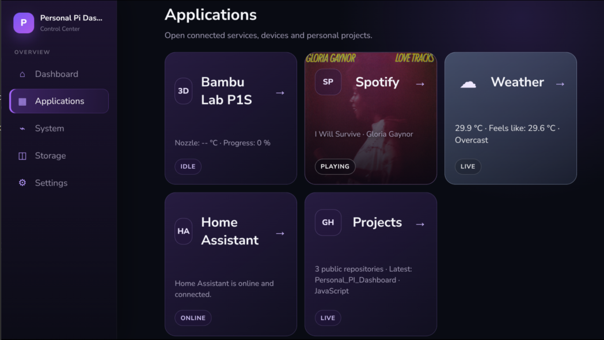
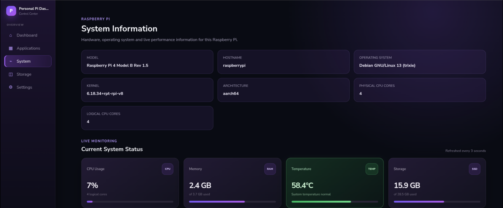
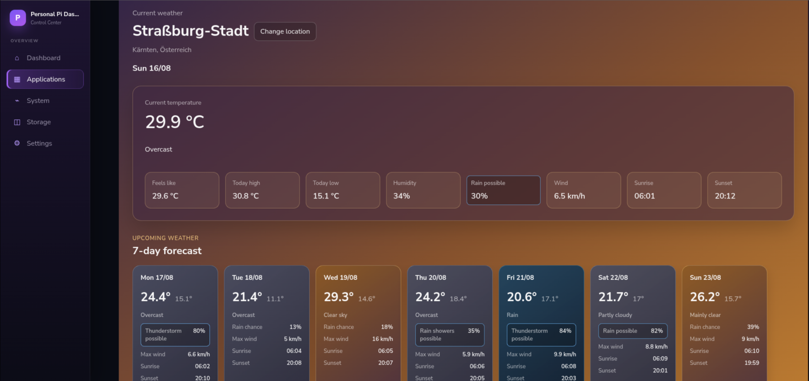
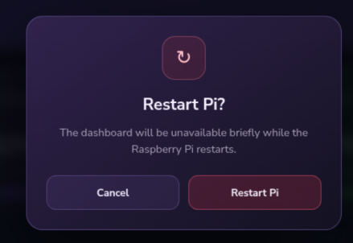
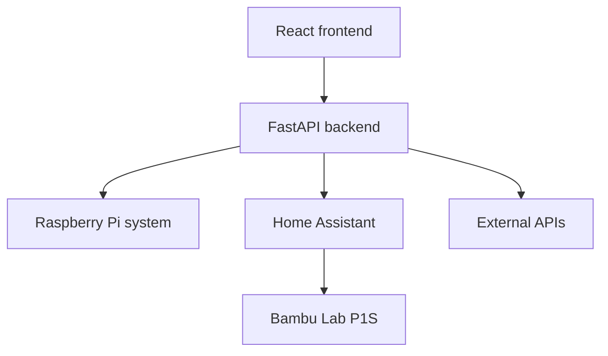

# Raspberry Pi Personal Dashboard

A modular, self-hosted dashboard built for a Raspberry Pi and a dedicated touchscreen. It brings system monitoring, weather, media controls, smart-home data, a Bambu Lab 3D printer, and developer information into one local interface.

The project is both a practical everyday tool and a long-term portfolio project. New integrations can be added without redesigning the complete application.

> **Project status:** Active development. The main React/FastAPI foundation and several integrations are already working; the interface and deployment process are still being improved.

## Screenshots

### Connected applications



### Raspberry Pi monitoring



### Weather dashboard



### Protected system controls



## Features

### Implemented

- Raspberry Pi system information and service status
- Current weather information
- Home Assistant connection status
- Bambu Lab P1S monitoring through Home Assistant
  - Online state and current print status
  - Progress, remaining time, layers, and temperatures
  - Printer, hardware, AMS, filament, fan, and file information
  - Pause, resume, stop, and force-refresh controls
  - Chamber-light control
  - Printing-speed selection when the printer exposes the control
- Spotify integration
  - Current track, artist, album, artwork, and device information
  - Play, pause, previous, next, and shuffle controls
- GitHub repository overview
- Independent loading, online, offline, and error states for integrations
- Responsive dark interface built from reusable React pages and components
- Touchscreen-focused navigation and kiosk mode
- Configurable refresh intervals, temperature warning limit, and weather location
- Confirmation dialogs for critical Raspberry Pi controls

### Planned

- Further UI polish and a short demonstration video
- Bambu Lab camera and model preview
- Additional Spotify controls such as volume and repeat
- More Home Assistant entities and controls
- Finance and portfolio overview
- Configurable dashboard widgets and settings
- Docker Compose deployment for the complete dashboard
- Optional PostgreSQL persistence
- Optional MQTT support for future ESP32 and hardware projects
- WebSocket-based live updates where polling is no longer sufficient

## Technology

| Layer | Technology |
|---|---|
| Frontend | React, JavaScript, React Router, CSS |
| Backend | Python, FastAPI, httpx, psutil |
| Smart home | Home Assistant REST API |
| 3D printer | Bambu Lab integration in Home Assistant |
| Media | Spotify Web API |
| Developer data | GitHub REST API |
| Host | Raspberry Pi 4 running Linux |
| Target display | 7-inch touchscreen |

PostgreSQL, MQTT, WebSockets, and a complete Docker Compose deployment are part of the future architecture, not requirements for the current version.

## Architecture



The frontend only communicates with the FastAPI backend. API credentials, Home Assistant tokens, entity IDs, OAuth tokens, and system-level operations remain on the backend.

See [docs/architecture.md](docs/architecture.md) for the complete technical design and data flows.

## Project Structure

The project currently follows this general structure:

```text
Personal_PI_Dashboard/
├── backend/
│   ├── routers/
│   │   ├── bambu.py
│   │   ├── github.py
│   │   ├── home_assistant.py
│   │   ├── spotify.py
│   │   ├── system.py
│   │   └── weather.py
│   ├── services/
│   │   ├── bambu_service.py
│   │   ├── github_service.py
│   │   ├── home_assistant_service.py
│   │   ├── spotify_service.py
│   │   ├── system_service.py
│   │   └── weather_service.py
│   ├── main.py
│   ├── config.py
│   ├── requirements.txt
│   └── .env.example
├── frontend/
│   ├── src/
│   │   ├── components/
│   │   ├── context/
│   │   ├── data/
│   │   ├── hooks/
│   │   ├── pages/
│   │   ├── utils/
│   │   └── App.jsx
│   └── package.json
├── docs/
│   ├── screenshots/
│   │   ├── applications.png
│   │   ├── safety_confirmation.png
│   │   ├── system.png
│   │   └── weather_app.png
│   └── architecture.md
├── .gitignore
├── LICENSE
└── README.md
```

The FastAPI backend is separated into thin API routers and service modules. Routers define the HTTP endpoints, while services contain integration and system logic. The React frontend follows the same modular approach with reusable components, hooks, contexts, and page-level views.

## Requirements

- Raspberry Pi or another Linux system
- Python 3.11 or newer
- Node.js and npm
- Home Assistant for smart-home and Bambu Lab integration
- A Home Assistant long-lived access token
- Spotify developer credentials for Spotify functionality
- Network access to the services used by the dashboard

Individual integrations can be unavailable without preventing the rest of the dashboard from running.

## Installation

### 1. Clone the repository

```bash
git clone https://github.com/Joshua000977/Personal_PI_Dashboard.git
cd Personal_PI_Dashboard
```

### 2. Set up the backend

```bash
cd backend
python3 -m venv .venv
source .venv/bin/activate
pip install -r requirements.txt
```

Create the backend `.env` file from the provided example and add the credentials and entity IDs for the integrations you want to use.

Start the backend:

```bash
uvicorn main:app --host 0.0.0.0 --port 8000 --reload
```

### 3. Set up the frontend

Open another terminal:

```bash
cd frontend
npm install
npm run dev -- --host 0.0.0.0
```

Open the address printed by Vite in a browser. On another device in the local network, use the Raspberry Pi hostname or IP address instead of `localhost`.

## Configuration

Sensitive configuration belongs in `backend/.env` and must never be committed.

The backend configuration includes categories such as:

- Frontend URL and CORS configuration
- Weather location
- Home Assistant URL and long-lived access token
- Bambu Lab Home Assistant entity IDs
- Spotify client ID, client secret, and redirect URI
- GitHub username

The frontend backend URL can be configured through a Vite environment variable:

```env
VITE_API_URL=http://raspberrypi.local:8000
```

Keep an `.env.example` file with empty or harmless example values so other users can understand the required configuration without exposing real secrets.

## Bambu Lab Integration

The dashboard does not connect directly to the printer. Home Assistant provides the printer entities, and FastAPI reads or controls those entities through the Home Assistant REST API.

Status flow:

```text
Bambu Lab P1S -> Home Assistant -> FastAPI -> React
```

Control flow:

```text
React button -> FastAPI allowlist -> Home Assistant service -> Bambu Lab P1S
```

The backend uses an allowlist for printer actions. The frontend cannot submit arbitrary Home Assistant domains, services, or entity IDs.

Some controls are only available in appropriate printer states. For example, pause and printing-speed controls may be unavailable while the printer is idle.

## Error Handling

Each integration is handled independently. If Spotify, Home Assistant, GitHub, weather, or the printer is unavailable, the affected page displays an error or offline state while the rest of the dashboard remains usable.

The frontend distinguishes between:

- Initial loading
- Available and online
- Available but offline
- Authentication failure
- Integration or network error

## Security

- Secrets and access tokens stay in the backend.
- Real `.env` files are excluded from Git.
- Printer and system controls are exposed through explicit backend endpoints.
- Arbitrary Home Assistant service calls are not accepted from the frontend.
- The dashboard is intended primarily for a trusted local network.
- Remote access should use a private solution such as Tailscale instead of exposing services directly to the internet.

## Roadmap

1. Continue polishing the Bambu Lab page and add camera or model previews.
2. Complete the remaining Spotify controls and presentation.
3. Improve visual consistency and responsive behavior across all pages.
4. Add a short demonstration video or GIF to the repository.
5. Add production frontend serving and automatic kiosk startup.
6. Add backend tests and automated GitHub checks.
7. Add Docker Compose deployment for the complete dashboard.
8. Add selected modules such as finance, MQTT devices, or persistent settings.

The roadmap is intentionally flexible. The dashboard is developed progressively, and every step should produce a useful improvement rather than only prepare for distant features.

## Motivation

This project is meant to become a real personal command center rather than a static demonstration. It combines frontend development, backend development, Linux, Raspberry Pi administration, networking, API integration, smart-home control, and hardware-related projects in one expandable system.

## License

This project is licensed under the [MIT License](LICENSE)