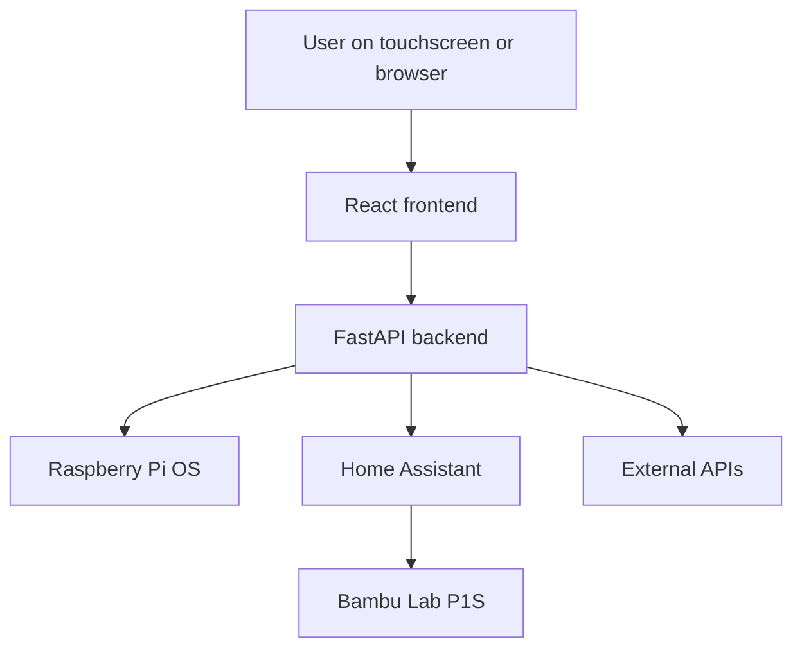
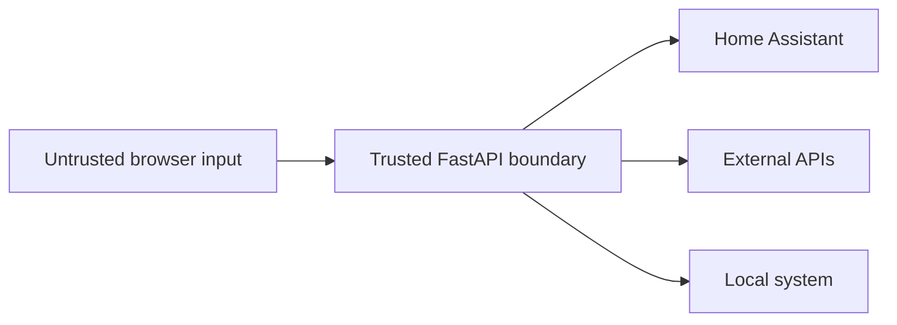
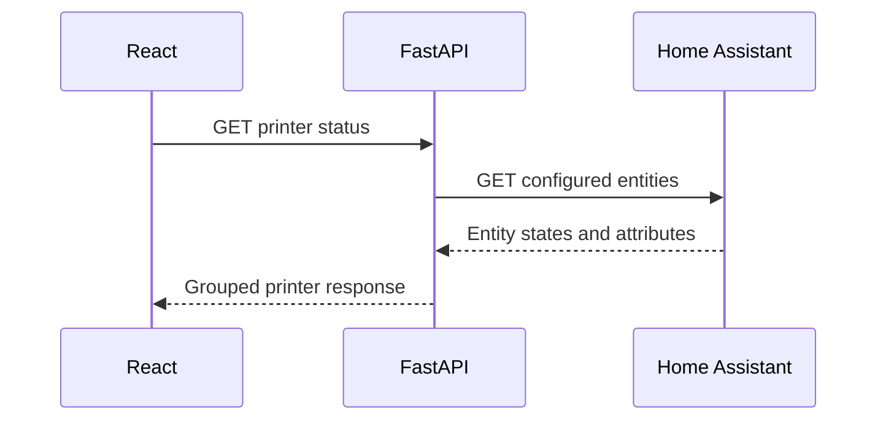
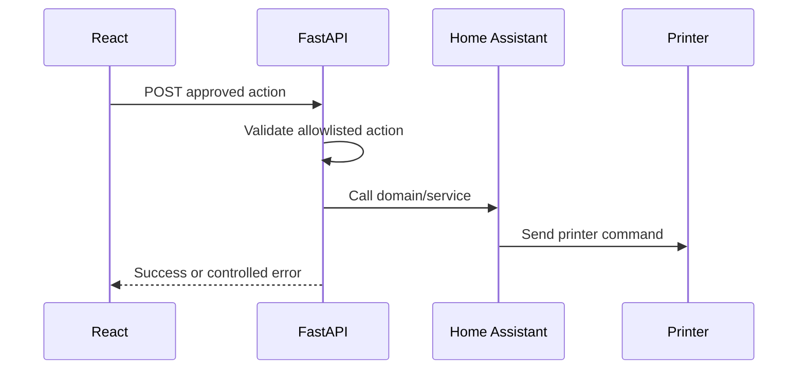
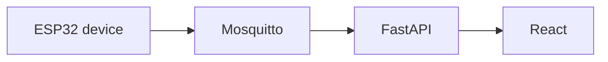

# Architecture

This document describes the current architecture of the Raspberry Pi Personal Dashboard and the direction in which it can evolve. Current components and future ideas are intentionally separated so the documentation does not imply that planned infrastructure is already implemented.

## 1. Design Goals

The architecture is guided by the following goals:

- Run reliably on a Raspberry Pi and a local touchscreen.
- Keep the visible interface independent from external services.
- Keep credentials and privileged operations out of the browser.
- Allow integrations to fail independently.
- Make new pages and data sources easy to add.
- Prefer understandable code while the project and its developer grow.
- Support a gradual transition from a personal prototype to a maintainable long-term system.

## 2. Current System Context



The browser communicates only with FastAPI. FastAPI acts as the trusted boundary between the user interface and local system functions, credentials, Home Assistant, and third-party APIs.

## 3. Current Components

### 3.1 React Frontend

The frontend is responsible for presentation and user interaction.

Current responsibilities include:

- Page routing and application navigation
- Fetching normalized data from FastAPI
- Loading, online, offline, and error states
- Polling integrations that require regular updates
- Displaying system, weather, Spotify, GitHub, Home Assistant, and printer data
- Sending explicit user actions such as Spotify or printer controls
- Touchscreen-friendly cards, controls, and progress displays

The frontend does not contain Home Assistant tokens, Spotify secrets, privileged system commands, or raw integration credentials.

Pages use custom hooks such as `useBambuStatus` to keep request and state-management logic separate from JSX presentation.

### 3.2 FastAPI Backend

FastAPI is the central integration and security layer.

Current responsibilities include:

- Exposing REST endpoints to the React application
- Reading Raspberry Pi system information with Python libraries such as `psutil`
- Calling external weather, Spotify, and GitHub APIs
- Managing Spotify authentication and tokens
- Reading Home Assistant entity states
- Aggregating many Bambu Lab entities concurrently
- Normalizing integration-specific data into stable frontend responses
- Translating approved frontend actions into Home Assistant service calls
- Handling integration failures without crashing the complete application

The backend currently lives mainly in `backend/main.py`. This keeps development straightforward, but the file should be split as the number of integrations and control endpoints grows.

### 3.3 Home Assistant

Home Assistant is the local integration layer for smart-home entities and the Bambu Lab P1S.

For the printer, Home Assistant provides:

- Status and progress sensors
- Temperature and layer sensors
- AMS and filament information
- Fan, light, and hardware entities
- Camera and file-related entities where available
- Button entities for pause, resume, stop, and refresh
- A select entity for printing speed

FastAPI reads states through Home Assistant's REST API and sends controls through Home Assistant services.

### 3.4 External APIs

External services currently include:

- Spotify Web API for player data and playback controls
- GitHub REST API for public repository information
- A weather service for current weather data

Every integration has its own availability and error state so one failed service does not disable unrelated dashboard pages.

### 3.5 Raspberry Pi Host

The Raspberry Pi provides:

- Linux host environment
- Local network connectivity
- FastAPI runtime
- Frontend development or production serving
- Access to CPU, memory, disk, temperature, uptime, and service information
- Target connection for a 7-inch touchscreen

The application is local-network-first. Remote access, when added, should use a private network layer rather than public port forwarding.

## 4. Trust Boundaries



The most important security boundary is between React and FastAPI.

React may request an approved action, for example:

```text
POST /api/home-assistant/bambu-printer/control/light_toggle
```

React may not provide an arbitrary Home Assistant entity ID or service name. FastAPI maps the approved action to a fixed domain, service, and backend-only entity ID.

This protects against a frontend user attempting to control unrelated Home Assistant devices.

## 5. Main Data Flows

### 5.1 Status Request



The backend uses `asyncio.gather()` with an asynchronous HTTP client to fetch independent Home Assistant entities concurrently. The response is then grouped into frontend-friendly sections such as:

- Printer
- Temperatures
- Layers
- Hardware
- Print details
- AMS
- Fans
- Lights
- Controls
- Files

The frontend therefore does not need to know Home Assistant's raw entity IDs or response structure.

### 5.2 Printer Control



Current mapped actions include:

| Frontend action | Home Assistant domain | Service |
|---|---|---|
| `refresh` | `button` | `press` |
| `pause` | `button` | `press` |
| `resume` | `button` | `press` |
| `stop` | `button` | `press` |
| `light_toggle` | `light` | `toggle` |

Printing speed is handled separately because `select.select_option` requires additional request data containing the selected option.

### 5.3 Spotify Authentication and Control

Spotify requires OAuth authentication. Client credentials and stored access or refresh tokens belong to the backend.

The frontend requests normalized playback state and sends player actions to FastAPI. FastAPI attaches the valid Spotify access token and communicates with the Spotify Web API.

### 5.4 Local System Monitoring

FastAPI reads local host information and exposes only the values required by the frontend. Privileged actions such as shutdown must remain explicit backend endpoints and should never accept arbitrary shell commands from the browser.

## 6. API Design

The API is organized by integration rather than exposing one generic proxy.

Current endpoint groups include:

- Raspberry Pi system status and actions
- Weather information
- Home Assistant status
- Bambu Lab printer status and controls
- Spotify authentication, playback state, and controls
- GitHub repositories

Recommended conventions:

- Use `GET` for status and data retrieval.
- Use `POST` for commands and actions.
- Return a predictable `available` field for integration status responses.
- Return normalized data instead of forwarding raw third-party responses.
- Convert expected integration failures into clear HTTP or JSON error states.
- Do not expose secrets, access tokens, or internal exception details.

## 7. Error Isolation

Each integration is treated as an independent dependency.

Example:

```text
Weather         Online
Spotify         Offline
Home Assistant  Online
Bambu printer   Offline
GitHub           Online
System status    Online
```

Spotify being unavailable must not prevent the system or weather pages from loading. The frontend shows a local error state for the affected page or card.

Backend requests use timeouts so a slow dependency cannot block indefinitely. HTTP errors are caught and converted into responses the frontend can handle.

## 8. Configuration and Secrets

Backend configuration is loaded from environment variables. Real values live in `backend/.env`, which must be ignored by Git.

Configuration categories include:

- Home Assistant URL and token
- Bambu Lab Home Assistant entity IDs
- Spotify client credentials and redirect URI
- GitHub username
- Weather location or provider configuration
- Frontend URL for CORS

The repository should provide `.env.example` with the same variable names but no real tokens, passwords, serial-derived private values, or OAuth credentials.

The frontend may contain a public backend base URL such as `VITE_API_URL`; it must not contain backend secrets.

## 9. Current Deployment Model

The current application is designed for a Raspberry Pi on a trusted local network.

A practical current deployment consists of:

```text
Raspberry Pi
├── FastAPI backend
├── React frontend
├── Home Assistant connection
└── Touchscreen browser
```

FastAPI can run as a `systemd` service so it starts automatically after boot. The frontend can initially run through Vite during development and later be built into static production files.

The target production startup sequence is:

```text
Raspberry Pi boot
-> backend service starts
-> frontend server starts
-> Chromium opens in kiosk mode
-> dashboard becomes available
```

## 10. Recommended Backend Refactor

As `main.py` grows, the backend can move toward:

```text
backend/
├── main.py
├── config.py
├── api/
│   ├── system.py
│   ├── weather.py
│   ├── home_assistant.py
│   ├── bambu.py
│   ├── spotify.py
│   └── github.py
├── services/
│   ├── home_assistant.py
│   ├── spotify.py
│   └── system.py
└── schemas/
    └── bambu.py
```

This refactor should happen when it reduces confusion, not only to make the folder tree look more advanced. The current single-file backend is acceptable while the developer is still learning the full data flow.

## 11. Future Architecture

The following components are planned possibilities rather than current dependencies.

### 11.1 Production Serving and Docker Compose

A future Docker Compose setup may include the frontend, backend, and optional supporting services. Home Assistant may remain an independently managed service.

Docker should be introduced when the development workflow and runtime configuration are stable enough to justify the additional deployment layer.

### 11.2 PostgreSQL

PostgreSQL may store:

- Dashboard settings
- Widget configuration
- Portfolio transactions and history
- Project milestones
- User preferences

It is not required for live integration data that can be requested directly from its source.

### 11.3 MQTT

Mosquitto MQTT may later connect custom ESP32 projects or a separate physical control device.



MQTT should be used for device events and commands, not as a replacement for every existing REST integration.

### 11.4 WebSockets

WebSockets may replace or supplement polling for high-frequency updates such as:

- Printer progress
- System metrics
- MQTT device events
- Notifications

Polling remains simpler and appropriate for data that changes slowly.

### 11.5 Remote Access

Remote access should use Tailscale or another private network solution. The dashboard, Home Assistant, FastAPI, MQTT, and databases should not be exposed directly to the public internet.

## 12. Architectural Principles

Future work should preserve these principles:

1. Keep secrets and privileged operations in the backend.
2. Prefer explicit integration endpoints over generic proxies.
3. Normalize external data before sending it to React.
4. Make integrations fail independently.
5. Add infrastructure only when it solves a real problem.
6. Keep code understandable enough that the developer can maintain and explain it.
7. Treat the local dashboard as a real product used every day, not only as a technical demonstration.
